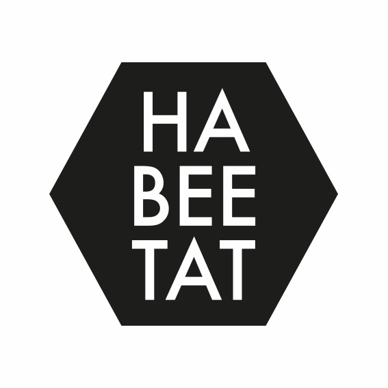

```{r setup, include=FALSE}
#library(flexdashboard)
library(knitr)
```

```{r, echo=FALSE, message=FALSE, warning=FALSE, out.width="25%", fig.align="center"}
# All defaults

```

### Un proyecto para conservar las poblaciones de abejas silvestres en los campos

Los polinizadores son insectos increíbles. La mayoría son abejas. Hay más de 1000 especies de abejas diferentes en España. Además, nos ayudan a polinizar las plantas y nuestros cultivos. Necesitamos diferentes especies de abejas, ya que cada una cumple funciones diferentes y se complementan.  

Por eso queremos ayudamos a los agricultores comprometidos a conservar las abejas silvestres en los campos de cultivo con este proyecto patrocinado por [**Granja San Francisco**](https://www.granjasanfrancisco.com/es/) para ayudara a las abejas en Cataluña.

```{r, echo=FALSE, message=FALSE, warning=FALSE, out.width="20%", fig.align="center"}
# All defaults
include_graphics("media/Paca.png")
```

### ¿Por qué?  
* Porque la biodiversidad es un tesoro que hay que conservar.  
* Porque las abejas están en declive.  
* Porque nos ayudan a mejorar el rendimiento del cultivo.  

### ¿Cómo?  
* Buscando soluciones con las que todos ganamos.   
* Pensando a largo plazo.   
* Llenando de plantas nativas nuestras lindes.    

### Nosotros te regalamos:  
* Una estudiada selección de plantas autóctonas que servirán de alimento para las abejas.  
* Un nido de abejas solitarias.  

### Tú te comprometes a plantarlas y cuidarlas  

Y si te apetece, nos ayudas observando las abejas de tu campo.  

> ¡Únete al proyecto!  
contáctanos en [info.abejas.silvestres@gmail.com](mailto:info.abejas.silvestres@gmail.com)  
> Formulario de [inscripción](https://forms.gle/3faU2jPJorpff57M8)

La evidencia científica muestra que cultivar con las abejas mejora el rendimiento del cultivo. La mayoria de practicas recomendadas no son nuevas, y pretenden recuperar el sentido comun a la hora de cuidar la tierra:  
```{r, echo=FALSE, message=FALSE, warning=FALSE, out.width="100%", fig.align="center"}
# All defaults

```
Puedes descargarte el tríptico [aquí](media/HABEETAT.pdf).

### Cómo puedes ayudarnos a investigar con tus datos y saber más sobre la polinización en tu finca.  

Recoger datos es importante para evaluar tanto la utilidad del proyecto, como el nivel de polinización de tu cultivo. Te animamos a recoger unos datos simples y compartirlos con nosotros una vez al año. Si bien este paso es voluntario, podemos ayudarte a conocer mejor el estado de polinización de tu cultivo. Puedes hacer todas estas cosas (o alguna de ellas).  

 * Haz una foto al margen que has plantado.   
 * En plena floración, paseate por el margen y apunta, que plantas están en flor, y cuantas abejas observas visitando flores en 10 minutos. Da igual que haya diferentes abejas, solo cuenta cuantas hay en total. Es importante medir los 10 minutos, para estandarizar los conteos.  
 * Elige una zona central de tu cultivo y cuenta cuantas visitas por flor recibe en 5 minutos (recuerda medir bien el tiempo). Puedes observar grupos de 5-10 flores, dependiendo del cultivo y luego dividir por el número de flores para obtener el número de visitas por flor. Lo ideal es hacer esto entre 3 y 5 veces para obtener una media representativa.   
 * Envía la información usando este [formulario](https://forms.gle/GujXsjcoS7TKJqBf6)  
 * Con estos datos, te contestaremos explicando más cosas sobre cómo estas contribuyendo a la conservación de abejas, y te daremos pautas sobre el nivel de polinización actual de tu cultivo.   


> Con la colaboración de:

```{r, echo=FALSE, message=FALSE, warning=FALSE, out.width="10%", fig.align="center"}
# All defaults
include_graphics("media/LOGO_GSF.png")

```
