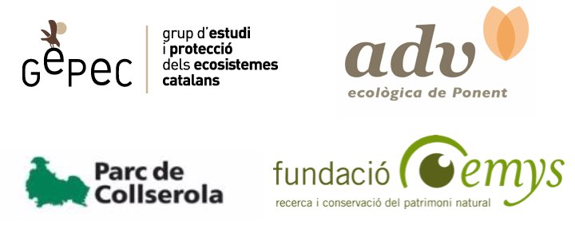

```{r setup, include=FALSE}
#library(flexdashboard)
library(knitr)
```

```{r, echo=FALSE, message=FALSE, warning=FALSE, out.width="25%", fig.align="center"}
# All defaults
include_graphics("media/habeetat.jpg")
```

### Un proyecto para conservar las poblaciones de abejas silvestres en los campos

Durante la temporada 2019-2020, la Asociación Abejas Silvestres, con la ayuda de muchos amigos, plantó más de 10.000 plantas nativas, e instaló más de 1000 hoteles para abejas en zonas agricolas. 

> Gracias a todos los que habeis participado!

```{r, echo=FALSE, message=FALSE, warning=FALSE, out.width="50%", fig.align="center"}
# All defaults

```
<p style="text-align: center;"> El proyecto ya se ha completado para la primavera 2020 con más de 100 agricultores implicados.</p>  

<center>

<iframe width="560" height="315" src="https://www.youtube.com/watch?v=Mw720c8MKVI&t" frameborder="1" allowfullscreen></iframe>

</center>

## El proyecto:

Los polinizadores son insectos increíbles. La mayoría son abejas. Hay más de 1000 especies de abejas diferentes en España. Además, nos ayudan a polinizar las plantas y nuestros cultivos. Necesitamos diferentes especies de abejas, ya que cada una cumple funciones diferentes y se complementan.  

Por eso queremos ayudamos a los agricultores comprometidos a conservar las abejas silvestres en los campos de cultivo con este proyecto que fue patrocinado por [**Granja San Francisco**](https://www.granjasanfrancisco.com/es/) para ayudara a las abejas en Cataluña.

```{r, echo=FALSE, message=FALSE, warning=FALSE, out.width="20%", fig.align="center"}
# All defaults

```

### ¿Por qué?  
* Porque la biodiversidad es un tesoro que hay que conservar.  
* Porque las abejas están en declive.  
* Porque nos ayudan a mejorar el rendimiento del cultivo.  

### ¿Cómo?  
* Buscando soluciones con las que todos ganamos.   
* Pensando a largo plazo.   
* Llenando de plantas nativas nuestras lindes.    

### Durante la campaña, nosotros regalamos:  
* Una estudiada selección de plantas autóctonas que servirán de alimento para las abejas.  
* Un nido de abejas solitarias.  

### Y los agricultores se comprometeron a plantarlas y cuidarlas  

Aunque ya no podemos financiar más plantas y nidos, si te apetece, puedes usar la información del proyecto para mejorar el habiitat en tu finca.     

```{r, echo=FALSE, message=FALSE, warning=FALSE, out.width="100%", fig.align="center"}
# All defaults
include_graphics("media/summary_HABEETAT.jpg")
```
La evidencia científica muestra que cultivar con las abejas mejora el rendimiento del cultivo. La mayoria de practicas recomendadas no son nuevas, y pretenden recuperar el sentido comun a la hora de cuidar la tierra: Puedes descargarte la guía de buenas prácticas [aquí](media/Guia_buenas_practicas.pdf).

### Cómo puedes ayudarnos a investigar con tus datos y saber más sobre la polinización en tu finca.  

Recoger datos es importante para evaluar tanto la utilidad del proyecto, como el nivel de polinización de tu cultivo. Te animamos a recoger unos datos simples y compartirlos con nosotros una vez al año. Si bien este paso es voluntario, podemos ayudarte a conocer mejor el estado de polinización de tu cultivo. Puedes hacer todas estas cosas (o alguna de ellas).  

 * En plena floración, paseate por el margen y apunta, que plantas están en flor, y cuantas abejas observas visitando flores en 10 minutos. Da igual que haya diferentes abejas, solo cuenta cuantas hay en total. Es importante medir los 10 minutos, para estandarizar los conteos.  
 * Elige una zona central de tu cultivo y cuenta cuantas visitas por flor recibe en 5 minutos (recuerda medir bien el tiempo). Puedes observar grupos de 5-10 flores, dependiendo del cultivo y luego dividir por el número de flores para obtener el número de visitas por flor. Lo ideal es hacer esto entre 3 y 5 veces para obtener una media representativa.   
 * Envía la información usando este [formulario](https://forms.gle/GujXsjcoS7TKJqBf6)  
 * Con estos datos, te contestaremos explicando más cosas sobre cómo estas contribuyendo a la conservación de abejas, y te daremos pautas sobre el nivel de polinización actual de tu cultivo.   


> Con la colaboración de:

```{r, echo=FALSE, message=FALSE, warning=FALSE, out.width="15%", fig.align="center"}
# All defaults

```

```{r, echo=FALSE, message=FALSE, warning=FALSE, out.width="50%", fig.align="center"}
# All defaults

```