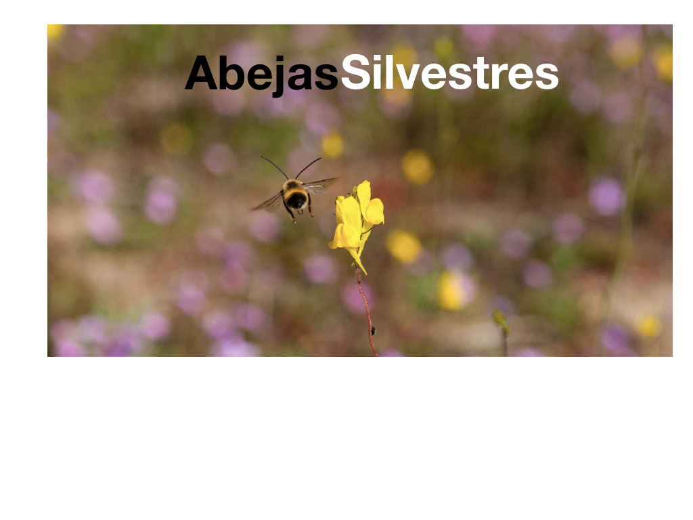

```{r setup, include=FALSE}
library(flexdashboard)
library(knitr)
```

Home
=========================================

```{r, echo=FALSE, message=FALSE, warning=FALSE, out.width="100%"}
# All defaults

```

#Proximamente...
