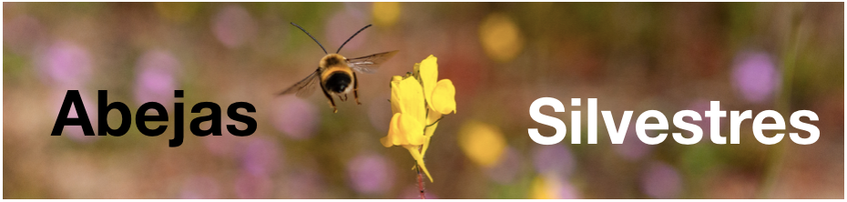
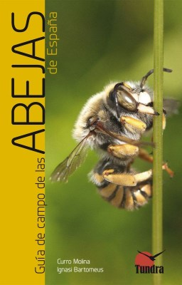

```{r setup, include=FALSE}
#library(flexdashboard)
library(knitr)
```
    

```{r, echo=FALSE, message=FALSE, warning=FALSE, out.width="100%"}
# All defaults

```

> Abejas Silvestres es una asociación sin ánimo de lucro para conservar y proteger las más de 1000 especies de abejas silvestres de la Peninsula Ibérica.   

## Quieres conocer y ayudar a las abejas silvestres?   

- Síguenos en twitter en **@[Abeja_Silvestre](https://twitter.com/Abeja_Silvestre)**   
- **[Explora nuestros recursos educativos](/resources.html)**  
- Hazte con la imprescindible **[Guía de campo de las abejas de España](https://www.tundraediciones.es/index.php?option=com_virtuemart&view=productdetails&virtuemart_product_id=390&virtuemart_category_id=25&lang=es)**  


```{r, echo=FALSE, message=FALSE, warning=FALSE, out.width="25%", fig.align="center"}
# All defaults

```

<a name="socio"></a>   

## Y hazte soci@!  

Os invitamos a sumaros a nuestra asociación. La cuota de socio son 12 EUR al año que se pagan usando la plataforma *Teaming*. *Teaming* es una forma fácil y segura de contribuir al proyecto con 1 euro al mes, y desgravable hasta el 75%.

Con tu apoyo contribuirás a financiar proyectos de conservación, generar recursos y guías que nos permitan informar mejor a la sociedad sobre las abejas silvestres. Como miembro del equipo recibirás actualizaciones de nuestras actividades.

Para hacerte socio o socia de la asociación solo tienes que:

1) **[Súmarte aquí a nuestro equipo Abejas Silvestres](https://www.teaming.net/abejassilvestres)**

2) **[Darte de alta en este formulario](https://forms.gle/s6NT9uZ8FuNzTW927)**

> Queremos regalar a todos los socios la Guía Visual de Abejorros Ibéricos. Dejanos tus datos y te la enviamos a casa!  


```{r, echo=FALSE, message=FALSE, warning=FALSE, out.width="100%", fig.align="center"}
# All defaults
include_graphics("media/guia_abejorros.jpg")
```

```{r, echo=FALSE, message=FALSE, warning=FALSE, out.width="50%", fig.align="center"}
# All defaults
include_graphics("media/LogoAAS.png")
```