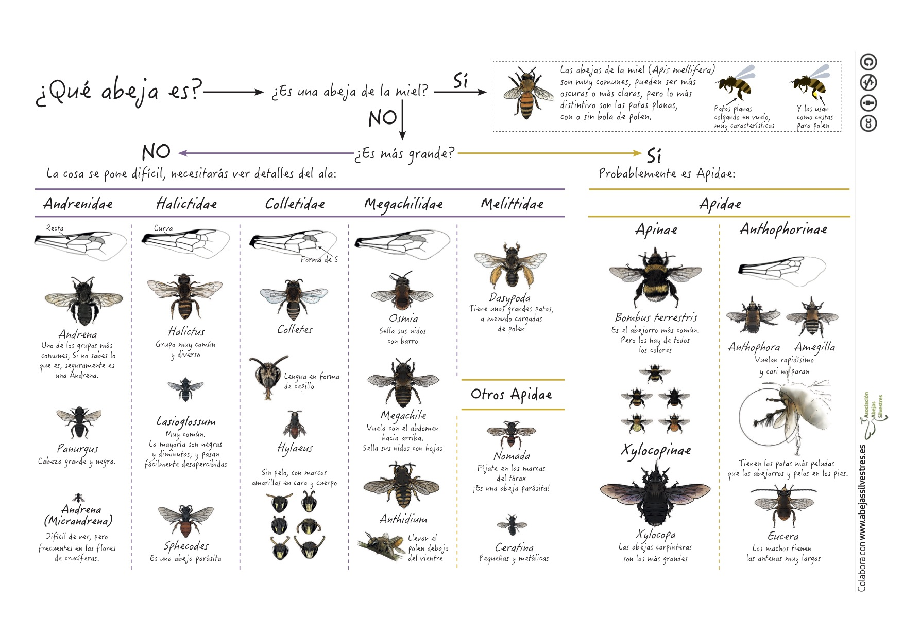

```{r setup, include=FALSE}
library(flexdashboard)
library(knitr)
# logo: logo.png
# favicon: favicon.png
```


Abejas silvestres {.storyboard}
=========================================

### Diversidad de abejas en España

```{r, echo=FALSE, message=FALSE, warning=FALSE}
library("leaflet")
library("htmltools")
library("vegan")
dat <- read.csv("_data/data.csv")
ji <- function(xy, origin=c(0,0), cellsize=c(1,1)) {
  t(apply(xy, 1, function(z) cellsize/2+origin+cellsize*(floor((z - origin)/cellsize))))
}
JI <- ji(cbind(dat$decimalLongitude, dat$decimalLatitude))
dat$X <- JI[, 1]
dat$Y <- JI[, 2]
dat$Cell <- paste(dat$X, dat$Y)
sample <- by(dat, dat$Cell, 
             function(d) c(d$X[1], d$Y[1], length(d$species)))
counts <- by(dat, dat$Cell, 
             function(d) c(d$X[1], d$Y[1], length(unique(d$species))))
estimated <- by(dat, dat$Cell, 
             function(d) c(d$X[1], d$Y[1], estimateR(table(d$species))))
#estimateR(table(dat$species))
counts.m <- matrix(unlist(counts), nrow=3)
rownames(counts.m) <- c("X", "Y", "Count")
counts.m <- as.data.frame(t(counts.m))
sample.m <- matrix(unlist(sample), nrow=3)
rownames(sample.m) <- c("X", "Y", "Sample")
sample.m <- as.data.frame(t(sample.m))
estimated.m <- matrix(unlist(estimated), nrow=7)
rownames(estimated.m) <- c("X", "Y", "Observed", "Chao1", "SE_Chao1", "ACE", "SE_ACE")
estimated.m2 <- as.data.frame(t(estimated.m))
estimated.m2$Count <- counts.m$Count
estimated.m2$Sample <- sample.m$Sample
#remove low sample size grids
#hist(estimated.m2$Sample)
estimated.m2 <- estimated.m2[which(estimated.m2$Sample > 40),]
estimated.m2$ACE[which(estimated.m2$ACE > 500)] <- 300
#pairs(estimated.m2)
pal <- colorNumeric(
  palette = sort(heat.colors(unique(estimated.m2$ACE)), decreasing = TRUE),
  domain = estimated.m2$ACE
)
leaflet(estimated.m2) %>% addTiles() %>%
  addCircles(lng = ~X-0.5, lat = ~Y, weight = 1, opacity = 1,fillOpacity = 0.5,
    radius = 40000, popup = ~ACE, color = ~pal(ACE),
    labelOptions = labelOptions(noHide = T, textOnly = TRUE, textsize = "2000px")
  )  %>%
  addLegend(position = "bottomright", 
          pal = pal, values = ~ACE,
    title = "Bee diversity",
    opacity = 1)
```

*** 

La Península Ibérica alberga más de 1.000 especies de abejas diferentes, un número que aumenta anualmente a medida que se van describiendo nuevas especies. En este mapa puedes visualizar el número estimado de especies de abejas observadas por cada 10 km2. Estamos trabajando en aumentar la base de datos en que se basa este mapa (actualmente solo contiene ~ 10.000 observaciones de 850 especies), por eso hay algunas zonas donde no existe estimación del número de especies. ¡Esperamos ir reduciendo estas zonas sin suficientes datos pronto!


### ¿Quién? y ¿Dónde?

```{r map occurrence, echo=FALSE, message=FALSE, warning=FALSE}
dat <- read.csv("_data/data.csv")
#need a tesaurus: 5b04107a2265c5000fab1d44
dat$content <- paste("<b><a href='", "http://www.traitbase.info/species?q=", "5b04145b2265c5000fab2abf" , "'target='_blank'>", dat$species, "</a></b>", "<br/>", 
  dat$family, "<br/>", paste(dat$day, dat$month, dat$year, sep = "/"), "<br/>", dat$recordedBy, "<br/>", sep = "")
pal <- colorFactor(
  palette = "Spectral",
  domain = dat$family
) #maybe check family NA?
map <- leaflet(dat)
map1.5 <- addTiles(map)
map2 <- addCircleMarkers(map = map1.5, lng = dat$decimalLongitude, 
                   lat = dat$decimalLatitude, 
                   label = ~htmlEscape(species),
                   popup = ~content,
                   color = ~pal(family),
                   clusterOptions = markerClusterOptions())
addLegend(map = map2, position = "bottomright", 
          pal = pal, values = ~unique(dat$family),
    title = "Bee family",
    opacity = 1)
```

*** 

La diversidad de morfologías, comportamientos y hábitos en las abejas es enorme. Existen especies de multitud de tamaños, desde muy grandes como algunas especies de abejas carpinteras (Xylocopa violacea, 3 cm de largo) hasta muy pequeñas como especies del grupo de las microandrenas (0.3 cm de largo). Mucha gente piensa que todas las abejas viven en colonias con una reina, muchas obreras y algunos zánganos, pero lo cierto es que la mayoría de las especies de abejas son solitarias. Es decir, no forman colmenas ni enjambres y en la mayoría de los casos tampoco producen miel. Si quieres explorar qué especies de abejas se han observado en diferentes puntos de la Península, puedes navegar por este mapa interactivo. Los enlaces de cada especie te llevarán a una página con algo más de información sobre algunas especies.

### ¿Qué es una abeja? 

```{r, echo=FALSE, message=FALSE, warning=FALSE, out.width="100%"}
# All defaults

```

*** 

Las abejas son insectos del orden de los himenópteros, uno de los más numerosos de los insectos, y que engloba a especies de abejas, abejorros, avispas y hormigas entre otros. Este orden se caracteriza por la presencia de dos pares de alas membranosas y de tres pares de patas. Las abejas, en particular, se diferencian de otras especies del orden con un aspecto similar, como las avispas, en que son exclusivamente vegetarianas, alimentándose durante toda su vida (tanto larvaria como adulta) de néctar y polen. Las avispas, en cambio, aunque también consumen polen y néctar, incluyen otros animales en su dieta. Las abejas suelen ser peludas, lo que facilita que el polen se quede adherido a su cuerpo, y poseen un par de antenas largas. Debido a su dependencia total del polen y néctar se las encuentra fácilmente cerca de flores. 

[Aquí](link) puedes descargarte una mini-guía con más información.

### ¿Cómo las puedo identificar?

```{r, echo=FALSE, message=FALSE, warning=FALSE, out.width="100%"}
# All defaults

```

*** 

En pleno vuelo es muy difícil identificar la especie a la que pertenece una abeja, ya que son pequeñas, muy rápidas y muchas se parecen entre sí. La especie más común de abeja que podemos ver en la Península Ibérica es la abeja de la miel (*Apis mellifera*). Otras abejas que también son fáciles de ver, sobre todo por su tamaño, son los abejorros y las abejas carpinteras. En España hay 6 familias de abejas que describimos en el mini-guía de la izquierda.

[Aquí](link) puedes descargarte una mini-guía con más información.

### ¿Qué les pasa a las abejas?

<iframe width="560" height="315" src="https://www.youtube.com/embed/n5udBqq3qYg" frameborder="0" allowfullscreen></iframe>

*** 

Seguramente habrás oído hablar de la desaparición de las abejas. En este video te explicamos qué les está pasando y cómo todos podemos ayudar a su conservación.


Recursos
=========================================

- Síguenos en twitter [@ abejasolitaria](https://twitter.com/Abeja_Silvestre).

- Aprende como [hacer un refugio para abejas solitarias](https://www.youtube.com/watch?v=1JOVKWPSuLY).  

- Próximamente publicaremos la **Guía de campo de las abejas de España**.

- Organizamos talleres de conservación, identificación y historia natural de abejas.

- Consultoría sobre acciones de conservación y servicios ecosistémicos

Hazte socio
=========================================

Os invitamos a sumaros a nuestra asociación. La cuota de socio son 12 EUR al año que se pagan usando la plataforma *Teaming*. *Teaming* es una forma fácil y segura de contribuir al proyecto con 1 euro al mes , y desgravable hasta el 75%.

Con tu apoyo contribuirás a generar recursos y guías que nos permitan informar mejor a la sociedad sobre las abejas silvestres. Como miembro del equipo recibirás actualizaciones de nuestras actividades.

[Súmate aquí a nuestro equipo Abejas Silvestres](https://www.teaming.net/cienciaparalasabejas)

Quien somos
=========================================

Socios fundadores: Ignasi Bartomeus, Ainhoa Magrach y Curro Molina. 

Contacto:   

Datos legales:  


