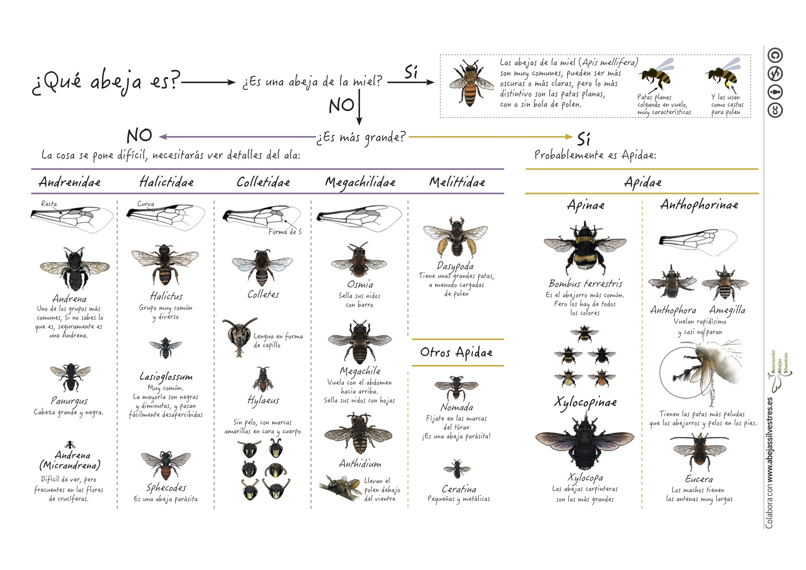

```{r setup, include=FALSE}
#library(flexdashboard)
library(knitr)
```

Nos encanta crear recursos para acercar el mundo de las abejas a todo el mundo.
    
### ¿Es esto una abeja? 

Las abejas son insectos del orden de los himenópteros, uno de los más numerosos de los insectos, y que engloba a especies de abejas, abejorros, avispas y hormigas entre otros. Este orden se caracteriza por la presencia de dos pares de alas membranosas y de tres pares de patas. Las abejas, en particular, se diferencian de otras especies del orden con un aspecto similar, como las avispas, en que son exclusivamente vegetarianas, alimentándose durante toda su vida (tanto larvaria como adulta) de néctar y polen. Las avispas, en cambio, aunque también consumen polen y néctar, incluyen otros animales en su dieta. Las abejas suelen ser peludas, lo que facilita que el polen se quede adherido a su cuerpo, y poseen un par de antenas largas. Debido a su dependencia total del polen y néctar se las encuentra fácilmente cerca de flores. 

```{r, echo=FALSE, message=FALSE, warning=FALSE, out.width="100%"}
# All defaults
include_graphics("media/es_abeja.jpg")
```

### ¿Y que abeja es? 

En pleno vuelo es muy difícil identificar la especie a la que pertenece una abeja, ya que son pequeñas, muy rápidas y muchas se parecen entre sí. La especie más común de abeja que podemos ver en la Península Ibérica es la abeja de la miel (*Apis mellifera*). Otras abejas que también son fáciles de ver, sobre todo por su tamaño, son los abejorros y las abejas carpinteras. En España hay 6 familias de abejas que describimos en la mini-guía de aquí arriba. Si quieres profundizar, hazte con la imprescindible [Guía de campo de las abejas de España](https://www.tundraediciones.es/index.php?option=com_virtuemart&view=productdetails&virtuemart_product_id=390&virtuemart_category_id=25&lang=es)

```{r, echo=FALSE, message=FALSE, warning=FALSE, out.width="100%"}
# All defaults

```

**[Aquí](/media/que_abeja.pdf) puedes descargarte la mini-guía en PDF.**  


### ¿Qué les pasa a las abejas?

Seguramente habrás oído hablar de la desaparición de las abejas. En este video te explicamos qué les está pasando y cómo todos podemos ayudar a su conservación.

<iframe width="560" height="315" src="https://www.youtube.com/embed/n5udBqq3qYg" frameborder="1" allowfullscreen></iframe>

### Más recursos:

- Aprende como [hacer un refugio para abejas solitarias](https://www.youtube.com/watch?v=1JOVKWPSuLY).  
- Infográfico sobre la importancia de las [redes planta-polinizador](https://ibartomeus.files.wordpress.com/2019/10/plant.pollinator.structure_for.social.media_spanish.jpg?w=584)
```{r, echo=FALSE, message=FALSE, warning=FALSE, out.width="50%", fig.align="center"}
# All defaults
include_graphics("media/infografico_ntw.jpg")
```

### Y no dudes en contactarnos si quieres

- Organizar talleres de conservación, identificación y historia natural de abejas.

- Consultoría sobre acciones de conservación y servicios ecosistémicos

- Usar AbejasSilvestres como plataforma para cualquier iniciativa relacionada con las abejas silvestres.

```{r, echo=FALSE, message=FALSE, warning=FALSE, out.width="50%", fig.align="center"}
# All defaults
include_graphics("media/LogoAAS.png")
```

```{r, echo=FALSE, fig.align="left", message=FALSE, warning=FALSE, out.width="75%"}
# All defaults
#
#
#include_graphics("media/Rhodanthidium.png")
```    